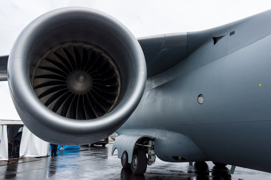

# N-CMAPSS_DL
DL evaluation on N-CMAPSS
Turbo fan engine           |  CMAPSS [[1]](#1)
:----------------------------:|:----------------------:
  |  

## Prerequisites


## Sample creator
Following the below instruction, you can create training/test sample arrays for machine learning model from N-CMAPSS datafile. <br/>
Please download Turbofan Engine Degradation Simulation Data Set-2, so called N-CMAPSS dataset [[2]](#2), from [NASA's prognostic data repository](https://ti.arc.nasa.gov/tech/dash/groups/pcoe/prognostic-data-repository/) <br/>
In the downloaded dataset, dataset DS01 has been used for the application of model-based diagnostics and dataset DS02 has been used for data-driven prognostics.   Therefore, we need only dataset DS02. <br/> 
Please locate "N-CMAPSS_DS02-006.h5"file to /N-CMAPSS folder. <br/>
Then, you can get npz files for each of 9 engines by running the python codes below. 
```bash
python3 sample_creator_unit_auto.py -w 50 -s 1 --test 0
```
After that, you should run 
```bash
python3 sample_creator_unit_auto.py -w 50 -s 1 --test 1
```
&ndash;  w : window length <br/>
&ndash;  s : stride of window <br/>
&ndash;  test : select train or test, if it is zero, then the code extracts samples from the engines used for training. Otherwise, it creates samples from test engines<br/>

Please note that we used N = 6 units (u = 2, 5, 10, 16, 18 & 20) for training and M = 3  units (u = 11, 14 & 15) for test, same as for the setting used in [[3]](#3). <br/>

Please note that the data type of the original data is 'np.float64' but we set the data type as 'np.float32' to reduce the size of the data considering memory when we load and create the samples. If you want to change the type, please check 'data_preparation_unit.py' file in /utils folder.  <br/>

Finally, you can have 9 npz file in /N-CMAPSS/Samples_whole folder. <br/>

Each compressed file contains two arrays with different labels: 'sample' and 'label'. In the case of the test units, 'label' indicates the ground truth RUL of the test units for evaluation. 

For instance, one of the created file, Unit2_win50_str1.npz, its filename indicates that the file consists of a collection of the sliced time series by time window size 50 from trajectory of engine (unit) 2. <br/>

## Load created samples
At first, you should load each of the npy files created in /Samples_whole folder. Then, the samples from the different engines should be aggregated. 
```bash
def load_part_array_merge (npz_units):
    sample_array_lst = []
    label_array_lst = []
    for npz_unit in npz_units:
      loaded = np.load(npz_unit)
      sample_array_lst.append(loaded['sample'])
      label_array_lst.append(loaded['label'])
    sample_array = np.dstack(sample_array_lst)
    label_array = np.concatenate(label_array_lst)
    sample_array = sample_array.transpose(2, 0, 1)
    return sample_array, label_array
```
The shape of your sample array should be (# of samples from all the units, window size, # of variables)


## References
<a id="1">[1]</a> 
Frederick, Dean & DeCastro, Jonathan & Litt, Jonathan. (2007). User's Guide for the Commercial Modular Aero-Propulsion System Simulation (C-MAPSS). NASA Technical Manuscript. 2007–215026. 

<a id="2">[2]</a> 
Arias Chao, Manuel & Kulkarni, Chetan & Goebel, Kai & Fink, Olga. (2021). Aircraft Engine Run-to-Failure Dataset under Real Flight Conditions for Prognostics and Diagnostics. Data. 6. 5. 10.3390/data6010005.

<a id="3">[3]</a> 
Arias Chao, Manuel & Kulkarni, Chetan & Goebel, Kai & Fink, Olga. (2020). Fusing Physics-based and Deep Learning Models for Prognostics. 


